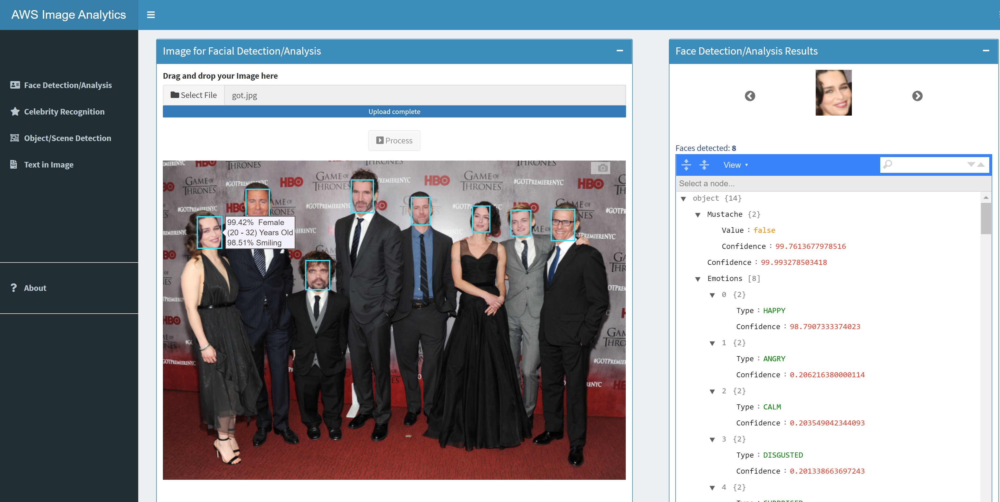

# Shiny AWS Image Analytics

Hosted in

* https://saulventura.shinyapps.io/AWSImageAnalytics/
* https://saulventura.shinyapps.io/AWSImageAnalytics1/

## Summary
This repo contains an R Shiny app that employs AWS Rekognition features. Using this tool requires some familiarity with R and Shiny.

## Files

* The 'app.R' file integrates 'server.R' and 'ui.R', files that contain the server and UI logic for the app respectively.
* The *.py files are Python functions that invoke the AWS Rekognition functionalities.
* The 'www/images' folder is requiredwhen deploying the Shiny app for temporary processing.
* 'AWSImageAnalytics.Rproj' is the R project file for the Shiny app

## Usage

1. Put apps.R in a new folder.
2. Add *.py files in the same folder.
3. Create an empty sub-folder path /www/images/
4. Register the AWS credentials in .Renviron file
5. Run locally (remove Python virtual environment creation) or deploy to ShinyApps.

